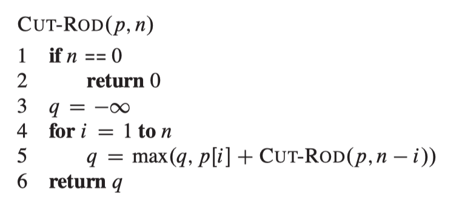
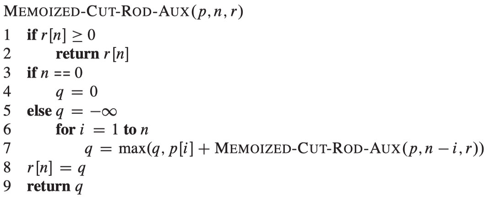
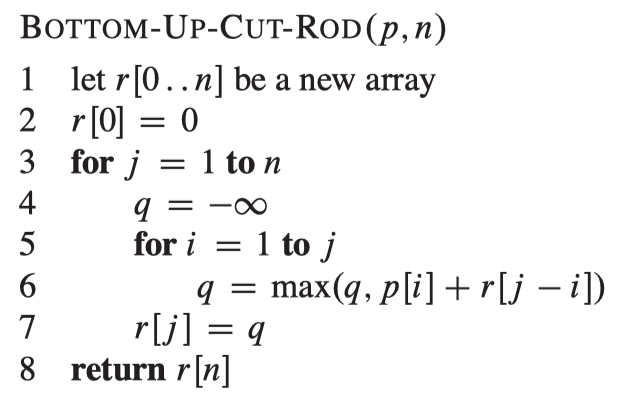

<a href="../README.md#2.5.1">Return to main page.</a>

### 2.5.1 Rod Cutting

| length *i*  | 1   | 2 | 3 | 4 | 5 | 6 | 7 | 8 | 9 | 10 |
| --------- | --- |---|---|---|---|---|---|---|---|---|
| price <i>Pi</i> | 1   | 5 | 8 | 9 | 10 | 17 | 17 | 20 | 24 | 30 |

<i>ri</i> : Revenue of a rob whose length is *i*.

<table>
<tr>
    <th>Three kinds of solutions</th>
    <th>Pseudocode</th>
</tr>
<tr>
    <td>
    <a href="./recursiveRodCut.py">Not Dynamic Programming approach (Recursive Top-Down implementation)</a>
    </td>
    <td>
    
    </td>
<tr>

<tr>
    <td>
    <a href="./xxx.py">Top-Down Dynamic Programming approach (Memoization)</a>
    </td>
    <td>
    
     
    
    </td>
</tr>

<tr>
    <td>
    <a href="./xxx.py">Down-Top Dynamic Programming approach</a>
    </td>
    <td>
    
    </td>
</tr>
</table>

<a href="../README.md#2.5.1">Return to main page.</a>
