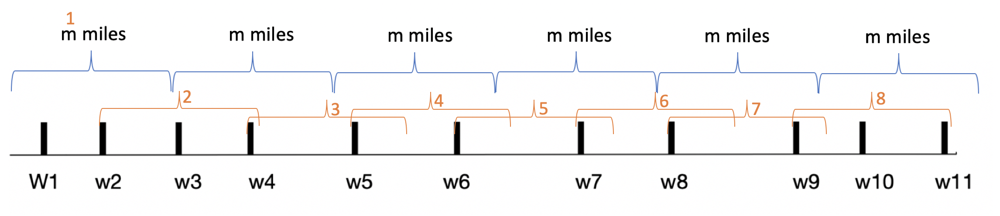

<a href="../README.md#3.2.3">Return to main page.</a>

### 3.2.3 Professor Gekko's skating expedition (Exercise 16.2-4, page 427)

<i>// This question comes form <a href="https://www.csee.umbc.edu/~chang/cs441/hw/hw8.shtml">Dr. Chang's website for 2018FALL CMSC441 HW8. </a> </i>

#### 16.2-4 

Professor Gekko has always dreamed of inline skating across North Dakota. He plans to cross the state on highway U.S. 2, which runs from Grand Forks, on the eastern border with Minnesota, to Williston, near the western border with Montana. 

The professor can carry two liters of water, and he can skate <i>m</i> miles before running out of water. (Because North Dakota is relatively flat, the professor does not have to worry about drinking water at a greater rate on uphill sections than on flat or downhill sections.) The professor will start in Grand Forks with two full liters of water. His official North Dakota state map shows all the places along U.S. 2 at which he can refill his water and the distances between these locations.

The professor’s goal is to minimize the number of water stops along his route across the state. Give an efficient method by which he can determine which water stops he should make. Prove that your strategy yields an optimal solution, and give its running time.

### Solution:

As shown in following picture, we select the farest water stop from those water stops in the range of *m* miles. In this case, the first set of water stops set will be {w1, w2}, and we select w2. 

Then we begin with w2, in the range of *m* miles, we have {w2, w3, w4}. Then we select the farest one, i.e. w4.

Then we have set {w4, w5}, {w5, w6}, {w6, w7}, {w7, w8}, {w8, w9}, {w9, w10, w11}.

So he shold stop at w2, w4, w5, w6, w7, w8, w9. 

<a href="../README.md#3.2.3">Return to main page.</a>