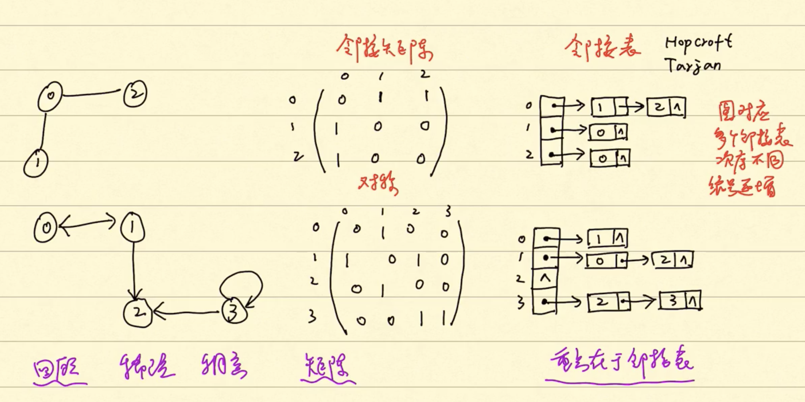
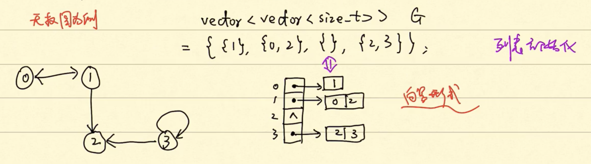

# CMSC441 & 641 Algorithm

This is a private place where I record my reviewing, thinking and reorganizaiton for "Algorithm" course. 


# 1. Sorting


<table>
<tr>
    <th>Time</th>
    <th><a href="https://www.codecogs.com/eqnedit.php?latex=\Theta(n^2)" target="_blank"></a> (\Theta(n^2))</th>
    <th><a href="https://www.codecogs.com/eqnedit.php?latex=$$\Theta(n^2)$$" target="_blank"></a></th>
</tr>

<tr>
    <th rowspan = "3">Sorting Algorithms</th>
    <td rowspan = "2"><a href="./insertsort">Insert Sort (sort in place)</a></td>
    <td><a href="./mergesort">Merge Sort</a></td>
</tr>

<tr>
    <td><a href="./heapsort">Heap Sort (sort in place)</a></td>
</tr>

<tr>
    <td><a href="./quicksort">Quick Sort (Worst)</a></td>
    <td><a href="./quicksort">Quick Sort (Avg) (sort in place)</a></td>
</tr>

</table>

[<p align="right"> GO TO TOP.</p>](#CMSC441--641-Algorithm)

# 2. Dynamic Programming
“Programming” in this context refers to a tabular method, not to writing computer code.

## 2.1 Divide-and-conquer VS Dynamic progrmming alg


## 2.2 Four steps for Dynamic Programming alg:
1. Characterize the structure of an optimal solution.

2. Recursively define the value of an optimal solution.

3. Compute the value of an optimal solution, typically in a bottom-up fashion.

4. Construct an optimal solution from computed information.

## 2.3 Characteristics
***optimal substructure***: optimal solutions to a problem incorporate/consists of optimal solutions to related subproblems, which we may solve independently.

[<p align="right"> GO TO TOP.</p>](#CMSC441--641-Algorithm)

## 2.4 Two ways to implement a dynamic-programming approach
### 2.4.1 top-down with memoization
- Recursively sovle problems as usual and memoized.
- But in each recursion frst check whether this subproblem has previously solved.
### 2.4.2 down-top
- Sort subproblems in size and solve them in size order.
- When solving a particular subproblem, we have already solved all of the smaller subproblems its solution depends upon, and we have saved their solutions

Dynamic programming thus **uses additional memory to save computation time**; it serves an example of a **time-memory trade-off**. The savings may be dramatic: an exponential-time solution may be transformed into a polynomial-time solution. A dynamic-programming approach runs in polynomial time when the number of distinct subproblems involved is polynomial in the input size and we can solve each such subproblem in polynomial time.

[<p align="right"> GO TO TOP.</p>](#CMSC441--641-Algorithm)

## 2.5 Examples
### <a href="./DP_rodcutting/rodcutting.md" id="2.5.1">2.5.1 Rod Cutting</a>

### <a href="./DP_carowner/carowner.md" id="2.5.2">2.5.2 Car Ownership</a>

### <a href="./DP_stampCollection/stampColletion.md" id="2.5.3">2.5.3 Stamp Collection</a>

### <a href="./DP_waldoworld/waldoWorld.md" id="2.5.4">2.5.4 Waldo's World</a>

### [2.5.5 Fibonacci number](./DP_fibonacci/dp_fibonacci.md)

### [2.5.6 Largest Common Subsequence](./DP_lcs/dp_lcs.md)

[<p align="right"> GO TO TOP.</p>](#CMSC441--641-Algorithm)


# 3. Greedy Alg

## 3.1 Theory

## 3.2 Examples
### <a href="./Greedy_gas/Eg_GreedyActivitySelection.md" id="3.2.1">3.2.1 Greedy Activity Selection</a>
 
### <a href="./Greedy_tricktreat/eg_greedytricktreat.md" id="3.2.2">3.2.2 Greedy Trick or Treat</a>

### <a href="./Greedy_skating/eg_greedyskating.md" id="3.2.3">3.2.3 Professor Gekko's skating expedition</a>

### <a href="./Greedy_unitLengthInterval/eg_unitLengthInterval.md" id="3.2.4">3.2.4 Unit-length intervals</a>

[<p align="right"> GO TO TOP.</p>](#CMSC441--641-Algorithm)


# 4. Graph Theory

## 4.1 Graph

**Graph**: G = (V, E). Self loop: (v, v).

**Undirected Graph**: Wire, Traffic netowkrs.

**Directed Graph**: Status transition, Markov model.

**Sparse Graph**: |E| << $|V|^2$.

**Dense Graph**: |E| $\approx$< $|V|^2$.

**Weighted Graph**: Distance, Density. 

**Adjacency-list** representation V.S. **Adjacency-matrix** representation:

</img>


When programming, how represent adjacency-list?
-  List, forward list.
-  Vector.              ```// Don't change often. Quicker. Easy for reading and writing.```
-  Set, unordered set.  ```// Easy for looking up.```



**Searching Algorithms:**

- **BFS**: Like water wave. Similiar to Tree‘s hierarchy traversal but the difference is we need to label whether we have visited this node or not, which is not necessary in THT.

  - Code: <a href="https://github.com/xiexiexx/Planet/blob/master/breadth_first_search/BFS.cpp">cpp</a>(<a href="./Graph/BFS.cpp">Backup</a>). 


- **DFS**: Widely used. Try best to visit as deeply as possible.

  - Code:.

For more, see <a href="./Graph/12.1 Graph Algorithms.pdf">slides of Dr. Chang</a>.


## 4.2 Example
### <a href="./Graph_2coloring/eg_2coloring.md" id="4.2.1">4.2.1 Two Coloring</a>
### <a href="./Graph_reachability/eg_reachability.md" id="4.2.2">4.2.2 Reachability</a>

## 4.3

## 4.4 Example
### <a href="./Graph_alternateTopologySort/eg_alternateTopologySort.md" id="4.4.1">4.4.1 Alternate topology sort</a>
### <a href="./Graph_semiconnected/eg_semiconnected.md" id="4.4.2">4.4.2 Semiconnected</a>
### <a href="./Graph_gossipMongering/eg_gossipMongering.md" id="4.4.3">4.4.3 Gossip Mongering</a>


[<p align="right"> GO TO TOP.</p>](#CMSC441--641-Algorithm)