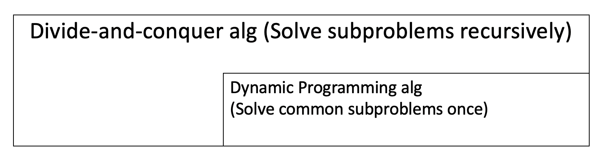
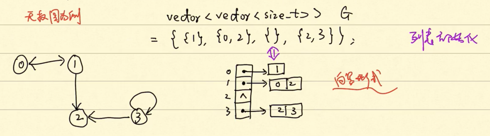
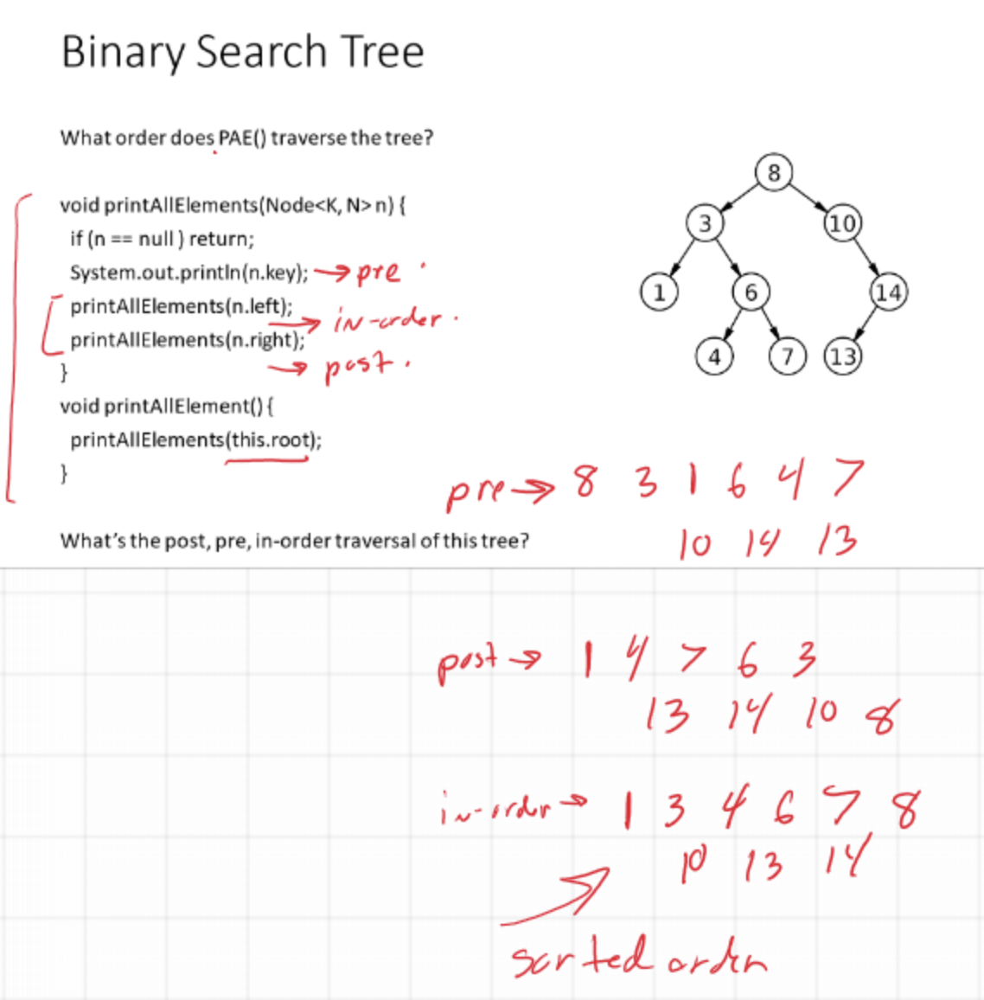

# CMSC441 & 641 Algorithm

This is a private place where I record my reviewing, thinking and reorganizaiton for "Algorithm" course (CMSC 441 & 641 and [Coursera Algorithms](https://www.coursera.org/learn/algorithms-part1/home/welcome)). More slides of Coursera Algorithm see [here](./files/c/). 


## [1. Sorting & Union-find](#1) 
## [2. Dynamic Programming](#2)
## [3. Greedy Alg](#3)
## [4. Graph Theory](#4)
### [4.1.1 Graph](#411)
### [4.1.2 Searching Algorithms: BFS, DFS](#412)
## [5. HashMap](#5)
## [6. Tree, BST](#6)

------

# <span id = "1">1. Sorting & [Union-find](https://algs4.cs.princeton.edu/home/) </span>


<table>
<tr>
    <th>Time</th>
    <th><a href="https://www.codecogs.com/eqnedit.php?latex=\Theta(n^2)" target="_blank"></a> (\Theta(n^2))</th>
    <th><a href="https://www.codecogs.com/eqnedit.php?latex=\Theta(nlogn)" target="_blank"></a> (\Theta(nlogn))</th>
</tr>

<tr>
    <th rowspan = "3">Sorting Algorithms</th>
    <td rowspan = "2"><a href="./files/insertsort">Insert Sort (sort in place)</a></td>
    <td><a href="./files/mergesort">Merge Sort</a></td>
</tr>

<tr>
    <td><a href="./files/heapsort">Heap Sort (sort in place)</a></td>
</tr>

<tr>
    <td><a href="./files/quicksort">Quick Sort (Worst)</a></td>
    <td><a href="./files/quicksort">Quick Sort (Avg) (sort in place)</a></td>
</tr>

</table>
 
## [Union-find](https://algs4.cs.princeton.edu/home/) of [Coursera](https://www.coursera.org/learn/algorithms-part1/home/welcome). 

(install OpenJDK 11 and IntelliJ IDEA [see princeton](https://lift.cs.princeton.edu/java/mac/))


[<p align="right"> GO TO TOP.</p>](#CMSC441--641-Algorithm)

# <span id = "2">2. Dynamic Programming</span>
“Programming” in this context refers to a tabular method, not to writing computer code.

## 2.1 Divide-and-conquer VS Dynamic progrmming alg




## 2.2 Four steps for Dynamic Programming alg:
1. Characterize the structure of an optimal solution.

2. Recursively define the value of an optimal solution.

3. Compute the value of an optimal solution, typically in a bottom-up fashion.

4. Construct an optimal solution from computed information.

## 2.3 Characteristics
***optimal substructure***: optimal solutions to a problem incorporate/consists of optimal solutions to related subproblems, which we may solve independently.

[<p align="right"> GO TO TOP.</p>](#CMSC441--641-Algorithm)

## 2.4 Two ways to implement a dynamic-programming approach
### 2.4.1 top-down with memoization
- Recursively sovle problems as usual and memoized.
- But in each recursion frst check whether this subproblem has previously solved.
### 2.4.2 down-top
- Sort subproblems in size and solve them in size order.
- When solving a particular subproblem, we have already solved all of the smaller subproblems its solution depends upon, and we have saved their solutions

Dynamic programming thus **uses additional memory to save computation time**; it serves an example of a **time-memory trade-off**. The savings may be dramatic: an exponential-time solution may be transformed into a polynomial-time solution. A dynamic-programming approach runs in polynomial time when the number of distinct subproblems involved is polynomial in the input size and we can solve each such subproblem in polynomial time.

[<p align="right"> GO TO TOP.</p>](#CMSC441--641-Algorithm)

## 2.5 Examples
### <a href="./files/DP_rodcutting/rodcutting.md" id="2.5.1">2.5.1 Rod Cutting</a>

### <a href="./files/DP_carowner/carowner.md" id="2.5.2">2.5.2 Car Ownership</a>

### <a href="./files/DP_stampCollection/stampColletion.md" id="2.5.3">2.5.3 Stamp Collection</a>

### <a href="./files/DP_waldoworld/waldoWorld.md" id="2.5.4">2.5.4 Waldo's World</a>

### [2.5.5 Fibonacci number](./files/DP_fibonacci/dp_fibonacci.md)

### [2.5.6 Largest Common Subsequence](./files/DP_lcs/dp_lcs.md)

[<p align="right"> GO TO TOP.</p>](#CMSC441--641-Algorithm)


# <span id="3">3. Greedy Alg</span>

## 3.1 Theory

## 3.2 Examples
### <a href="./files/Greedy_gas/Eg_GreedyActivitySelection.md" id="3.2.1">3.2.1 Greedy Activity Selection</a>
 
### <a href="./files/Greedy_tricktreat/eg_greedytricktreat.md" id="3.2.2">3.2.2 Greedy Trick or Treat</a>

### <a href="./files/Greedy_skating/eg_greedyskating.md" id="3.2.3">3.2.3 Professor Gekko's skating expedition</a>

### <a href="./files/Greedy_unitLengthInterval/eg_unitLengthInterval.md" id="3.2.4">3.2.4 Unit-length intervals</a>

[<p align="right"> GO TO TOP.</p>](#CMSC441--641-Algorithm)


# <span id="4">4. Graph Theory</span>

## <span id="411">4.1.1 Graph</span>

**Graph**: G = (V, E). Self loop: (v, v).

**Undirected Graph**: Wire, Traffic netowkrs.

**Directed Graph**: Status transition, Markov model.

**Sparse Graph**: |E| << $|V|^2$.

**Dense Graph**: |E| $\approx$< $|V|^2$.

**Weighted Graph**: Distance, Density. 

**Adjacency-list** representation V.S. **Adjacency-matrix** representation:

</img>


When programming, how represent adjacency-list?
-  List, forward list.
-  Vector.              ```// Don't change often. Quicker. Easy for reading and writing.```
-  Set, unordered set.  ```// Easy for looking up.```



[<p align="right"> GO TO TOP.</p>](#CMSC441--641-Algorithm)


## <span id="412">4.1.2 Searching Algorithms:</span>

- **BFS**: Like water wave. Similiar to Tree‘s hierarchy traversal but the difference is we need to label whether we have visited this node or not, which is not necessary in THT.

  - Code: <a href="https://github.com/xiexiexx/Planet/blob/master/breadth_first_search/BFS.cpp">cpp</a>(<a href="./files/Graph/BFS.cpp">Backup</a>). 


- **DFS**: Widely used. Try best to visit as deeply as possible.

  - Code:.

For more, see <a href="./files/Graph/12.1 Graph Algorithms.pdf">Graph theory slides of Dr. Chang</a>.
Or see CSE12 PA3, Lecture08, MAZE Stack Queue BFS DFS of UCSD.

Usually, use ***queue*** to implement the BFS, use ***stack*** to implement DFS. 

BFS/queue explore all possible nodes at same level/distance before moving further to next level/distance+1. 
- This property makes it pretty good at finding ***shortest path***, because it will explore all possible paths with length l before to explore all possible paths with length l+1. 
- This property also makes it visit some nodes which are unnecessary for shortest path, which means more memory usage.

DFS/stack will stick with one direction once it's possible to continue. It doesn't stop that direction until it goes to a dead end. Then it switches to another direction. So DFS might find the shortest path but cannot guarantee it. 

Queue in java can be implemented using LinkedList or ArrayList. Stack in java can be implemented using Stack calss. 

[Difference between BFS and DFS Binary Tree:](https://www.guru99.com/difference-between-bfs-and-dfs.html)
|BFS|	DFS|
|:-|:-|
|BFS finds the shortest path to the destination.|	DFS goes to the bottom of a subtree, then backtracks.|
|The full form of BFS is Breadth-First Search.|	The full form of DFS is Depth First Search.|
|It uses a queue to keep track of the next location to visit.|	It uses a stack to keep track of the next location to visit.|
|BFS traverses according to tree level.|	DFS traverses according to tree depth.|
|It is implemented using FIFO list.|	It is implemented using LIFO list.|
|It requires more memory as compare to DFS.|	It requires less memory as compare to BFS.|
|This algorithm gives the shallowest path solution.|	This algorithm doesn't guarantee the shallowest path solution.|
|There is no need of backtracking in BFS.|	There is a need of backtracking in DFS.|
|You can never be trapped into finite loops.|	You can be trapped into infinite loops.|
|If you do not find any goal, you may need to expand many nodes before the solution is found.|	If you do not find any goal, the leaf node backtracking may occur.|


[<p align="right"> GO TO TOP.</p>](#CMSC441--641-Algorithm)


## 4.2 Example
### <a href="./files/Graph_2coloring/eg_2coloring.md" id="4.2.1">4.2.1 Two Coloring</a>
### <a href="./files/Graph_reachability/eg_reachability.md" id="4.2.2">4.2.2 Reachability</a>

## 4.3

## 4.4 Example
### <a href="./files/Graph_alternateTopologySort/eg_alternateTopologySort.md" id="4.4.1">4.4.1 Alternate topology sort</a>
### <a href="./files/Graph_semiconnected/eg_semiconnected.md" id="4.4.2">4.4.2 Semiconnected</a>
### <a href="./files/Graph_gossipMongering/eg_gossipMongering.md" id="4.4.3">4.4.3 Gossip Mongering</a>


[<p align="right"> GO TO TOP.</p>](#CMSC441--641-Algorithm)


# <span id="5">5. HashMap </span>


[<p align="right"> GO TO TOP.</p>](#CMSC441--641-Algorithm)


# <span id="6">6. Tree, Binary Search Tree </span>

Definition: A ***BST (Binary Search Tree)*** is a tree, where at **every** node, all keys to the **left** of that node is **smaller** than that key, and all keys to the **right** are **larger**.


PAE: print all elements. 

[PAE/searching algorithms: (more)](files/tree/pae.md)

| Depth-first (Stack) | Breadth-first (Queue) |  
|---|---|
|  Pre-order, O(n) | Level-order, O(n)   |  
|  In-order, O(n)  |   |  
| Post-order, O(n) ||


</img>


[<p align="right"> GO TO TOP.</p>](#CMSC441--641-Algorithm)

