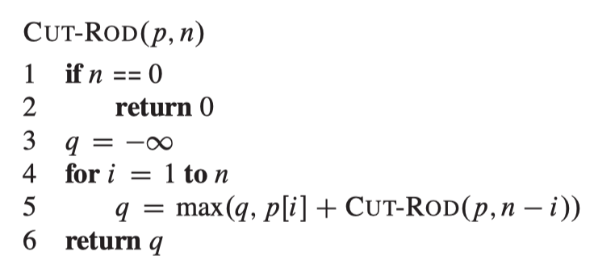

# CMSC441_algorithm

This is a private place where I record my review, thinking and reorganizaiton for "Algorithm" course. 

# 1. Sorting

<table>
<tr>
    <th>Time</th>
    <th> </th>
    <th></th>
</tr>

<tr>
    <th rowspan = "3">Sorting Algorithms</th>
    <td rowspan = "2"><a href="./insertsort">Insert Sort (sort in place)</a></td>
    <td><a href="./mergesort">Merge Sort</a></td>
</tr>

<tr>
    <td><a href="./heapsort">Heap Sort (sort in place)</a></td>
</tr>

<tr>
    <td><a href="./quicksort">Quick Sort (Worst)</a></td>
    <td><a href="./quicksort">Quick Sort (Avg) (sort in place)</a></td>
</tr>

</table>

# 2. Dynamic Programming
“Programming” in this context refers to a tabular method, not to writing computer code.

## 2.1 Divide-and-conquer VS Dynamic progrmming alg

## 2.2 Four steps for Dynamic Programming alg:
1. Characterize the structure of an optimal solution.

2. Recursively define the value of an optimal solution.

3. Compute the value of an optimal solution, typically in a bottom-up fashion.

4. Construct an optimal solution from computed information.

## 2.3 Characteristics
***optimal substructure***: optimal solutions to a problem incorporate/consists of optimal solutions to related subproblems, which we may solve independently.

## 2.4 Two ways to implement a dynamic-programming approach
### 2.4.1 top-down with memoization
- Recursively sovle problems as usual and memoized.
- But in each recursion frst check whether this subproblem has previously solved.
### 2.4.2
- Sort subproblems in size and solve them in size order.
- When solving a particular subproblem, we have already solved all of the smaller subproblems its solution depends upon, and we have saved their solutions

Dynamic programming thus **uses additional memory to save computation time**; it serves an example of a **time-memory trade-off**. The savings may be dramatic: an exponential-time solution may be transformed into a polynomial-time solution. A dynamic-programming approach runs in polynomial time when the number of distinct subproblems involved is polynomial in the input size and we can solve each such subproblem in polynomial time.

## 2.5 Examples
### 2.5.1 Rod Cutting

| length *i*  | 1   | 2 | 3 | 4 | 5 | 6 | 7 | 8 | 9 | 10 |
| --------- | --- |---|---|---|---|---|---|---|---|---|
| price  | 1   | 5 | 8 | 9 | 10 | 17 | 17 | 20 | 24 | 30 |

 : Revenue of a rob whose length is *i*.

<table>
<tr>
    <td>
    <a href="./rodcutting/recursiveRodCut.py">Original recursive solution:</a>
    </td>
    <td>
    
    </td>
<tr>

</table>