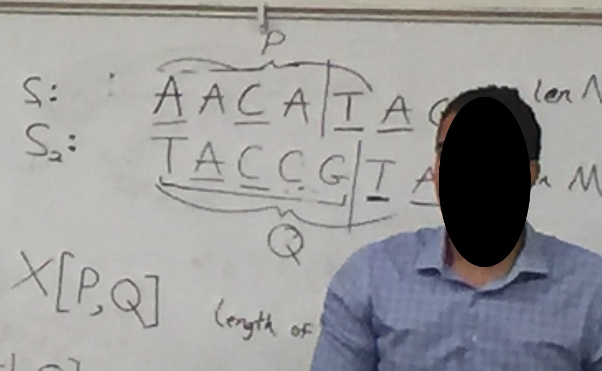

<a href="../README.md#2.5.1">Return to main page.</a>

### 2.5.6 Largest Common Subsequence

S1: **A**A**C**A**TA**G   (len: N)

S2: T**AC**CG**TA**     (len:M)

LCS: ACTA 



**X[P,Q]**: length of LCS between S1 with P elements and S2 with Q elements.

So the largest possible is X[N,M]. So the space cost is O(M*M).


**Optimal Substructure:**
- Case 1: S1[P] != S2[Q] (Last elements are not common)
  
    X[P,Q] = max(X[P, Q-1], X[P-1, Q])
- Case 2: S1[P] == S2[Q] (Last elements are common, like inside the pic, they are both 'T')
  
    X[P,Q] = 1 + X[P-1, Q-1]

Pseudocode:
```python
int X[N,M]

for P = 1 ... N
    for Q = 1 ... M
        if (S1[P] != S2[Q])
            X[P,Q] = max(X[P, Q-1], X[P-1, Q])
        else
            X[P,Q] = 1 + X[P-1, Q-1]
```


<a href="../README.md#2.5.1">Return to main page.</a>