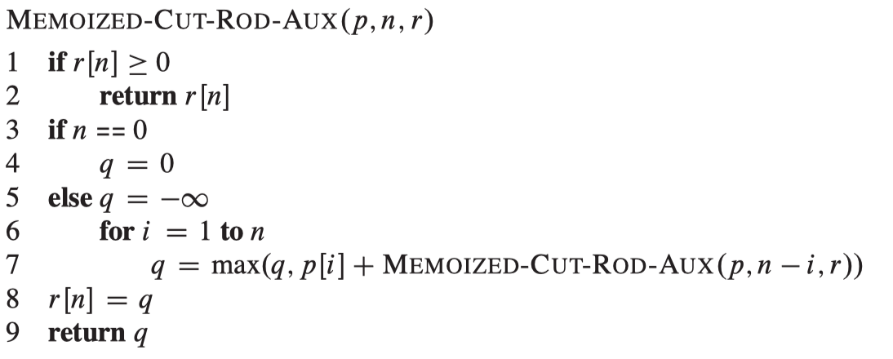

<a href="../../README.md#2.5.1">Return to main page.</a>

### 2.5.1 Rod Cutting

| length *i*  | 1   | 2 | 3 | 4 | 5 | 6 | 7 | 8 | 9 | 10 |
| --------- | --- |---|---|---|---|---|---|---|---|---|
| price <a href="https://www.codecogs.com/eqnedit.php?latex=p_i" target="_blank"></a> | 1   | 5 | 8 | 9 | 10 | 17 | 17 | 20 | 24 | 30 |

<a href="https://www.codecogs.com/eqnedit.php?latex=p_i" target="_blank"></a> : Revenue of a rob whose length is *i*.

<table>
<tr>
    <th>Three kinds of solutions</th>
    <th>Pseudocode</th>
</tr>
<tr>
    <td>
    <a href="./recursiveRodCut.py">Not Dynamic Programming approach (Recursive Top-Down implementation)</a>
    </td>
    <td>
    
    </td>
<tr>

<tr>
    <td>
    Top-Down Dynamic Programming approach (Memoization) (TBC)
    </td>
    <td>
    
    <br>
    
    </td>
</tr>

<tr>
    <td>
    Down-Top Dynamic Programming approach (TBC)
    </td>
    <td>
    
    </td>
</tr>
</table>


------
### Solution 2, by Prof. David Chapman.
|L|1|3|5|
|-|-|-|-|
|P|1|4|6|
|K(index)|0|1|2|


**X[B]**: maximal price for cutting rod with len B

We can see this question as two pieces of rod. First part is a rod with len *L_a*, and the left part is a rod with len *B-L_a*. 

**Optimal sub-structure:**
**X[B] = P_a + X[B - L_a]**

1<=a<=K, **a** is the index. **L_a** is the length of one piece of rod, while **P_a** is the price of that piece of rod. 

Pseudocode:
```python
X[N] # store all results of sub-questions

for B = 1...N
    X[B] = P_1 + X[B - L_1]

    for a = 1...K
        if (B - L_a >= 0)
            X[B] = max( X[B], P_a + X[B - L_a])
```


<a href="../../README.md#2.5.1">Return to main page.</a>