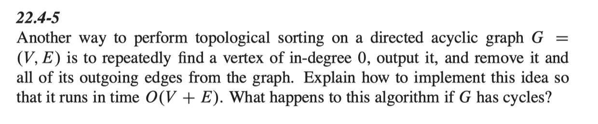

<a href="../../README.md#4.4.1">Return to main page.</a>

### 4.4.1 Alternate topology sort

<i>// This question comes form <a href="https://www.csee.umbc.edu/~chang/cs441/hw/hw10.shtml">Dr. Chang's website for 2018FALL CMSC441 HW10. </a> </i>

Exercise 22.4-5, page 615.
 

<i>Note:</i> the issue here is that as you remove edges from the graph,
you will create more vertices with in-degree 0. How do you keep track of
that in <i>O</i>( <i>V</i> &plus; <i>E</i> ) time?

### ***Solution：***

<a href="../../README.md#4.4.1">Return to main page.</a>
