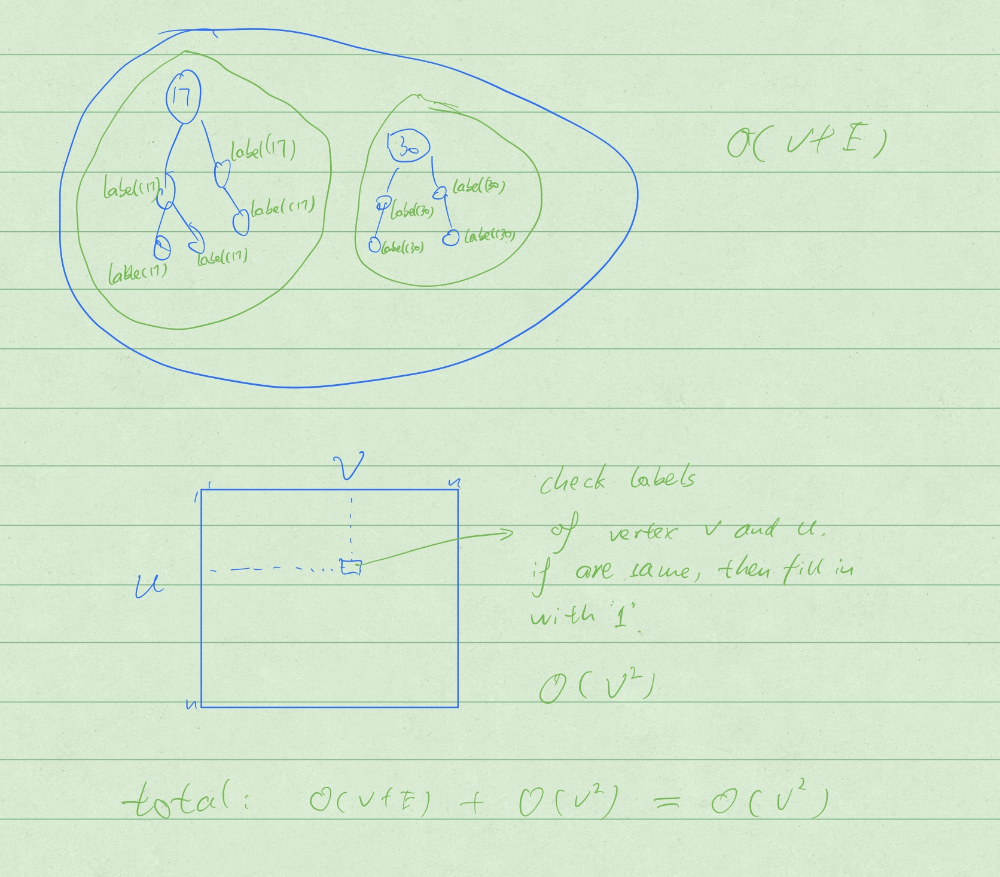

<a href="../../README.md#4.2.2">Return to main page.</a>

### 4.2.2 Reachability

<i>// This question comes form <a href="https://www.csee.umbc.edu/~chang/cs441/hw/hw9.shtml">Dr. Chang's website for 2018FALL CMSC441 HW9. </a> </i>


You are given a 
<span style="color:gray;"><s>connected</s></span>
undirected graph <i>G</i> = (<i>V</i>,
<i>E</i>&thinsp;) as an adjacency list. 
<span style="color:red;">
***The graph <i>G</i> might not be connected.***
</span>
You want to fill-in a two-dimensional
array <tt>R[,]</tt> so that <tt>R[</tt><i>u</i>,<i>v</i><tt>]</tt> 
is 1 if there is a path from vertex <i>u</i> to vertex <i>v</i>.
If no such path exists, then <tt>R[</tt><i>u</i>,<i>v</i><tt>]</tt> is 0.
From this two-dimensional array, you can determine whether 
vertex <i>u</i> is reachable from vertex <i>v</i> in <i>O</i>(1) time
for any pair of vertices <i>u</i> and <i>v</i>.

<P>
Describe an algorithm that fills in <tt>R[,]</tt> in 
<i>O</i>(<i>V</i>&thinsp;<sup>2</sup>&thinsp;) 
time. Briefly justify the running time of your algorithm.

### ***Solution：***
```
Step 1: BFS or DFS. //Running time of both are O(V+E).
		Label each vertexes in this BFS tree with it root's number.  
		Finally we can label every vertex with a label. For those vertexes 
        which has same label, they can reach each other. 

Step 2: fill in the 2-D array R[,] // Running time is O(V^2)

Total running time is O(V+E) + O(V^2) = O(V^2) 
```



<a href="../../README.md#4.2.2">Return to main page.</a>
