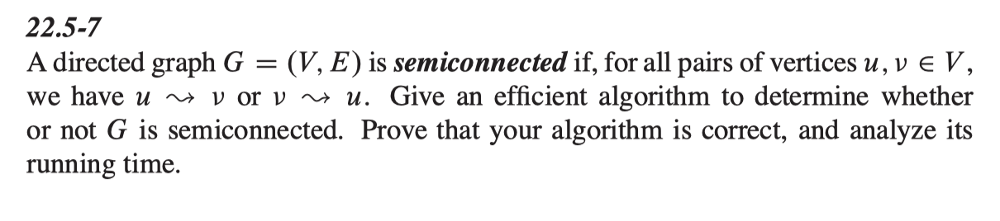

<a href="../../README.md#4.4.2">Return to main page.</a>

### 4.4.2 Semiconnected

<i>// This question comes form <a href="https://www.csee.umbc.edu/~chang/cs441/hw/hw10.shtml">Dr. Chang's website for 2018FALL CMSC441 HW10. </a> </i>

Exercise 22.5-7, page 621.
 

<i>Hint:</i> Think about strongly-connected components and component
graphs.

### ***Solution：***

<a href="../../README.md#4.4.2">Return to main page.</a>
