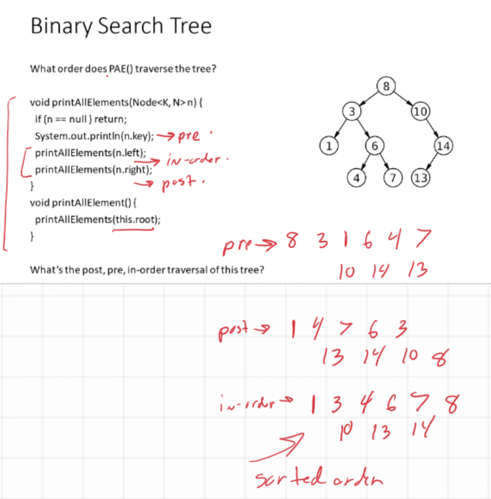

<a href="../../README.md#6">Return to main page.</a>

# PAE/searching algorithms:


| Depth-first (Stack) | Breadth-first (Queue) |  
|---|---|
|  Pre-order | Level-order  |  
|  In-order |   |  
| Post-order||
|||


## Pre-order Tree Traversal, O(n):
1. Visit node.
2. Traverse left.
3. Traverse right.

```python
preorder(node)
    if node == null: return
    visit(node);
    preorder(node.left);
    preorder(node.right);
```

## In-order Tree Traversal, O(n):
1. Traverse left.
2. Visit node.
3. Traverse right.

```python
inorder(node)
    if node == null: return
    inorder(node.left);
    visit(node);
    inorder(node.right);
```


## Post-order Tree Traversal, O(n):
1. Traverse left.
2. Traverse right.
3. Visit node.

```python
postorder(node)
    if node == null: return
    postorder(node.left);
    postorder(node.right);
    visit(node);
```

## Level-order Tree Traversal, O(n):

</img>


</img>


<a href="../../README.md#6">Return to main page.</a>
